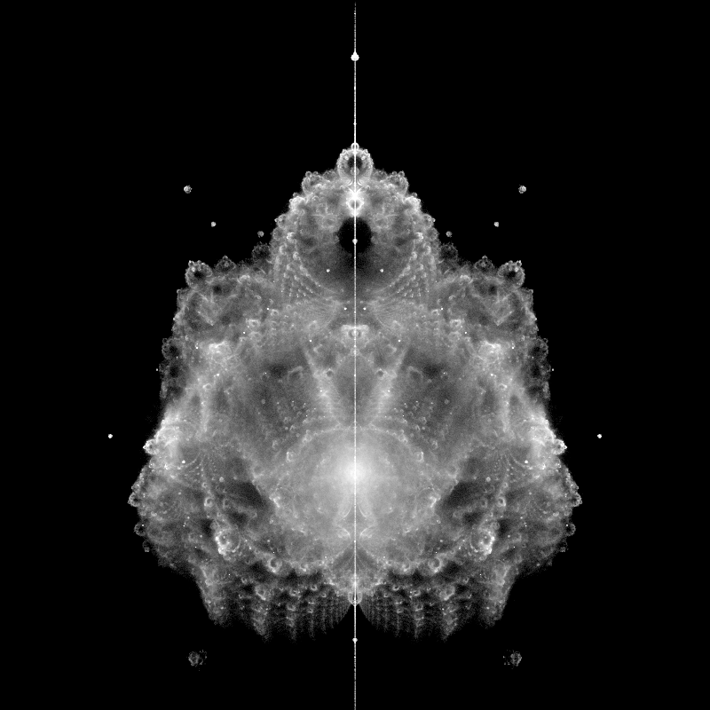

# Buddhabrot Explorer

Interactive Buddhabrot renderer with a Qt GUI for sampling, refinement, and color post-processing.



## Features
- GUI controls for samples, iterations, resolution, and complex-plane bounds
- Multithreaded Buddhabrot generation via Numba
- Post-processing options: scaling modes, colormaps, clipping, and optional blur
- Preset save/load to `presets/` and image export to `images/`
- Mouse wheel zoom and click-drag panning in the preview

## Requirements
- Python 3.9+
- `PySide6`, `numpy`, `numba`
- Optional: `matplotlib` for extra colormaps

## Run
```bash
python main.py
```

## Notes
- Presets are saved as JSON in `presets/`.
- Exported renders are saved as PNGs in `images/`.
