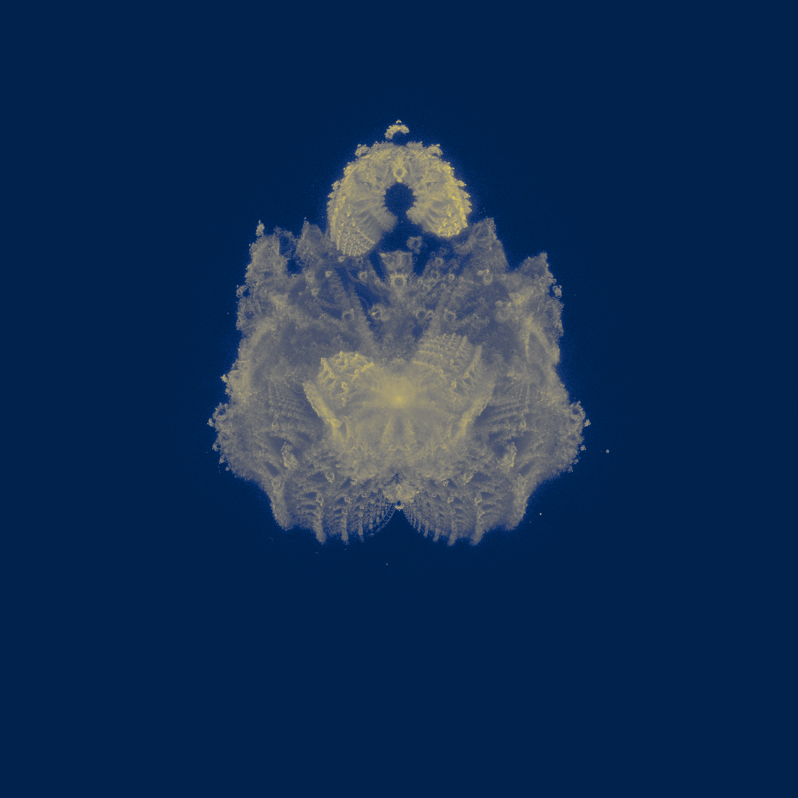

# BuddhaBrot Explorer



## Overview
**BuddhaBrot Explorer** is a Python project for generating and visualizing the BuddhaBrot fractal. The project explores the parameter space of the BuddhaBrot fractal using randomized parameters and various colormaps. This results in high-resolution, vibrant visualizations of the BuddhaBrot with evolving shapes and colors.

## Features
- High-quality BuddhaBrot fractal generation with customizable parameters.
- Randomized sampling of parameters such as iteration count, sample size, and coloring schemes.
- Generate a series of frames with distinct styles.
- Supports multiple colormaps for diverse fractal colorings.
  
## Installation
1. Clone the repository:
   ```bash
   git clone git@github.com:ASFaust/buddhabrot.git

To complete the `readme.md` file, you can add sections for Usage, Contributing, and License. Here's a suggestion:

## Usage
To generate BuddhaBrot images, run the `explore.py` script. This will generate a series of images with randomized parameters and save them in the `buddhabrot_exploration_images` directory.

To generate a high-quality BuddhaBrot animation, run the `funky.py` script. This will generate a series of frames and compile them into a video named `buddhabrot_animation_high_quality.mp4`.
## Using the `generate_buddhabrot` Function

The `generate_buddhabrot` function is used to generate a BuddhaBrot image by sampling orbits near the boundary of the Mandelbrot set. It uses binary stepping to get interesting orbits and captures the full orbit.

Here's an example of how to use the function:

```python
from bhuddabrot import generate_buddhabrot
import numpy as np
from tqdm import tqdm

width = 1000
height = 1000
samples = 10000
max_iter = 1000
max_steps = 4

# Generate BuddhaBrot image
with tqdm(total=samples, desc="Generating BuddhaBrot", unit="samples") as pbar:
    buddhabrot_image = generate_buddhabrot(width, height, samples, max_iter, max_steps, pbar, inside_point = 0.01+0.01j, outside_point = None)
```

## Contributing
Pull requests are welcome. For major changes, please open an issue first to discuss what you would like to change.

## License
[MIT](https://choosealicense.com/licenses/mit/)

For the `requirements.txt` file, you need to list all the Python packages that your project depends on. Based on the code excerpts you provided, your project uses the following packages:

- numpy
- tqdm
- PIL (Pillow)
- matplotlib
- Cython

Here's how you can create a `requirements.txt` file:

```plaintext
numpy==1.21.2
tqdm==4.62.3
Pillow==8.3.2
matplotlib==3.4.3
Cython==0.29.24
```

Please replace the version numbers with the ones that are compatible with your project.